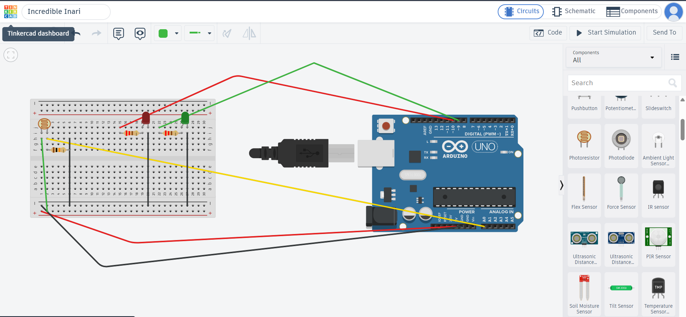

# arduino-ldr-automatic-light
Arduino project using an LDR to control red and green LEDs based on light intensity.

## Tinkercad Simulation
View the simulation on Tinkercad : https://www.tinkercad.com/things/8E14bfArlw3-incredible-inari/editel?returnTo=%2Fthings%2F8E14bfArlw3-incredible-inari&sharecode=JjJvAH-inc4w8HGas5hngBwqx-GFNUbCc9imz9_owUc

## Components

- Arduino Uno
- LDR (Light Dependent Resistor)
- 10kΩ resistor
- Red LED
- Green LED
- 220Ω resistors
- Breadboard
- Jumper wires

## Working

The LDR detects the intensity of surrounding light.

- If the sensor reading is below 200 → Red LED turns ON
- If the sensor reading is above 700 → Green LED turns ON

The Arduino reads the LDR voltage through the analog input and controls the LEDs accordingly.

## Circuit

## Arduino Code

The Arduino source code is available in `ldr-automatic-lights.ino.ino`.

## Result

The LEDs respond automatically to changes in the detected light intensity.
